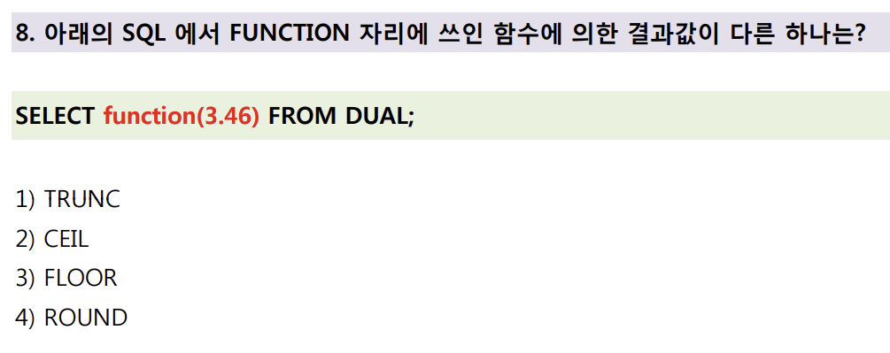

# 📌 숫자 관련 함수 결과 비교 – `TRUNC`, `CEIL`, `FLOOR`, `ROUND`

| 항목     | 설명                                                             |
| ------ | -------------------------------------------------------------- |
| 배경 개념  | 숫자 처리 함수들은 소수점 이하를 반올림하거나 자르거나, 정수 범위로 올리거나 내리는 등의 기능을 수행함     |
| 핵심 포인트 | 각 함수는 소수점 이하 처리 방식이 다르며, **정수로 변환된 결과값이 같을 수도, 다를 수도 있음**      |
| 출제 의도  | 각 함수의 동작 원리를 이해하고, 같은 입력 값에 대해 어떤 함수가 **다른 결과를 반환하는지**를 식별하는 것 |

---

## ✅ 문제

---

## ❌ 오답 기록

### 오답: 1번 `TRUNC`

* 처음에는 `CEIL(3.46)`와 `FLOOR(3.46)`이 동일할 거라 생각하여 `TRUNC`가 다르다고 착각함
* 그러나 실제로는 `TRUNC(3.46)`과 `FLOOR(3.46)` 모두 `3`을 반환함

---

## ✅ 정답: 2번 `CEIL`

### 각 함수의 반환 결과

| 함수            | 결과값       | 설명                                    |
| ------------- | --------- | ------------------------------------- |
| `TRUNC(3.46)` | `3`       | 소수점 이하 **잘라냄** (버림)                   |
| `CEIL(3.46)`  | `4`       | 소수점 **올림** → 가장 가까운 **큰 정수**로 이동      |
| `FLOOR(3.46)` | `3`       | 소수점 **버림** → 가장 가까운 **작은 정수**로 이동     |
| `ROUND(3.46)` | `3` | 소수 첫째 자리 기준으로 **반올림** → `0.5` 이상이면 올림 |

* 이 중 `CEIL`만 결과가 `3`로 나머지 함수들과 **다른 값 반환**

---

## 📚 추가 개념 정리

| 함수      | 의미                      | 예시 (`3.46`) |
| ------- | ----------------------- | ----------- |
| `TRUNC` | 소수점 이하 **잘라냄**          | `3`         |
| `CEIL`  | 소수점 올림 → **큰 쪽 정수** 반환  | `4`         |
| `FLOOR` | 소수점 버림 → **작은 쪽 정수** 반환 | `3`         |
| `ROUND` | 반올림                     | `3`         |

---

## 📝 느낀 점

* 평소 익숙하게 쓰던 `ROUND`, `TRUNC`, `FLOOR`, `CEIL`도 **비슷해 보여도 정확히 다르다**는 점을 실감
* 특히 `TRUNC`와 `FLOOR`은 결과가 같아 보여도 **동작 방식이 다름**
  → `TRUNC`는 **정밀도 지정 가능**, `FLOOR`은 무조건 **정수 방향 버림**