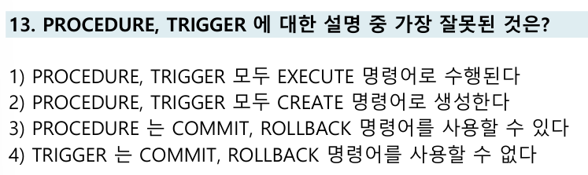

# 📌 PROCEDURE, TRIGGER 오답노트

| 항목           | 설명                                                    |
| ------------ | ----------------------------------------------------- |
| PROCEDURE 정의 | 일련의 SQL 문들을 저장해두고 필요할 때 **명시적으로 실행**하는 저장 루틴          |
| TRIGGER 정의   | 테이블에 정의된 **DML 이벤트 발생 시 자동으로 실행**되는 DB 객체 (자동 트리거 기능) |
| 주요 차이점       | 호출 방식, 트랜잭션 제어 가능 여부, 사용 목적 등에서 차이가 있음                |

---

## 문제

---

## ❌ 오답 선택: 4번

> `TRIGGER는 COMMIT, ROLLBACK 명령어를 사용할 수 없다`

* 처음에는 "트리거에서도 트랜잭션 제어가 가능하지 않을까?" 하는 생각으로 **틀린 문장으로 보이지 않아 4번을 선택**함.
* 하지만 실제로는 **트리거에서는 COMMIT, ROLLBACK 명령어를 사용할 수 없다**는 점이 맞는 설명임.
* 이유는 트리거가 실행되는 시점은 하나의 트랜잭션 안이기 때문에, 중간에 커밋이나 롤백이 발생하면 **트랜잭션의 원자성 보장이 깨지게 됨**.

✔ 따라서 4번은 올바른 설명이며, 정답이 **아님**

---

## ✅ 정답: 1번

> `PROCEDURE, TRIGGER 모두 EXECUTE 명령어로 수행된다`

* `PROCEDURE`는 `EXECUTE`나 `CALL` 명령어로 직접 실행할 수 있지만,
  `TRIGGER`는 명시적으로 실행할 수 없고, **INSERT, UPDATE, DELETE 등의 이벤트 발생 시 자동 실행**됩니다.

---

## 선택지 정리

| 번호 | 선택지 내용                                    | 설명                    |
| -- | ----------------------------------------- | --------------------- |
| 1번 | PROCEDURE, TRIGGER 모두 EXECUTE 명령어로 수행된다   | ❌ TRIGGER는 EXECUTE 불가 |
| 2번 | PROCEDURE, TRIGGER 모두 CREATE 명령어로 생성한다    | ✅ 맞음                  |
| 3번 | PROCEDURE는 COMMIT, ROLLBACK 명령어를 사용할 수 있다 | ✅ 맞음                  |
| 4번 | TRIGGER는 COMMIT, ROLLBACK 명령어를 사용할 수 없다   | ✅ 맞음                  |

---

## 추가 설명 & 복습 포인트

| 개념              | 설명                                                           |
| --------------- | ------------------------------------------------------------ |
| PROCEDURE 실행 방식 | `EXEC proc_name`, `CALL proc_name()`                         |
| TRIGGER 실행 방식   | **자동 실행**, 명시적 호출 불가                                         |
| 트랜잭션 제어 가능 여부   | `PROCEDURE`: 가능 / `TRIGGER`: 제한됨 (오라클, MySQL, PostgreSQL 공통) |

👉 Velog 링크: [[SQL] Procedure와 Trigger 개념 정리 및 비교](https://velog.io/@wjpark4430/SQL-Procedure와-Trigger-개념-정리-및-비교)

---

## 느낀 점

* 트리거는 **자동 실행되고, 트랜잭션 내부에서 동작**하므로 명시적 커밋은 허용되지 않음을 배움.
* 이번 문제를 통해 PROCEDURE와 TRIGGER의 **실행 방식과 트랜잭션 처리 차이**에 대해 더 명확히 이해할 수 있었음.