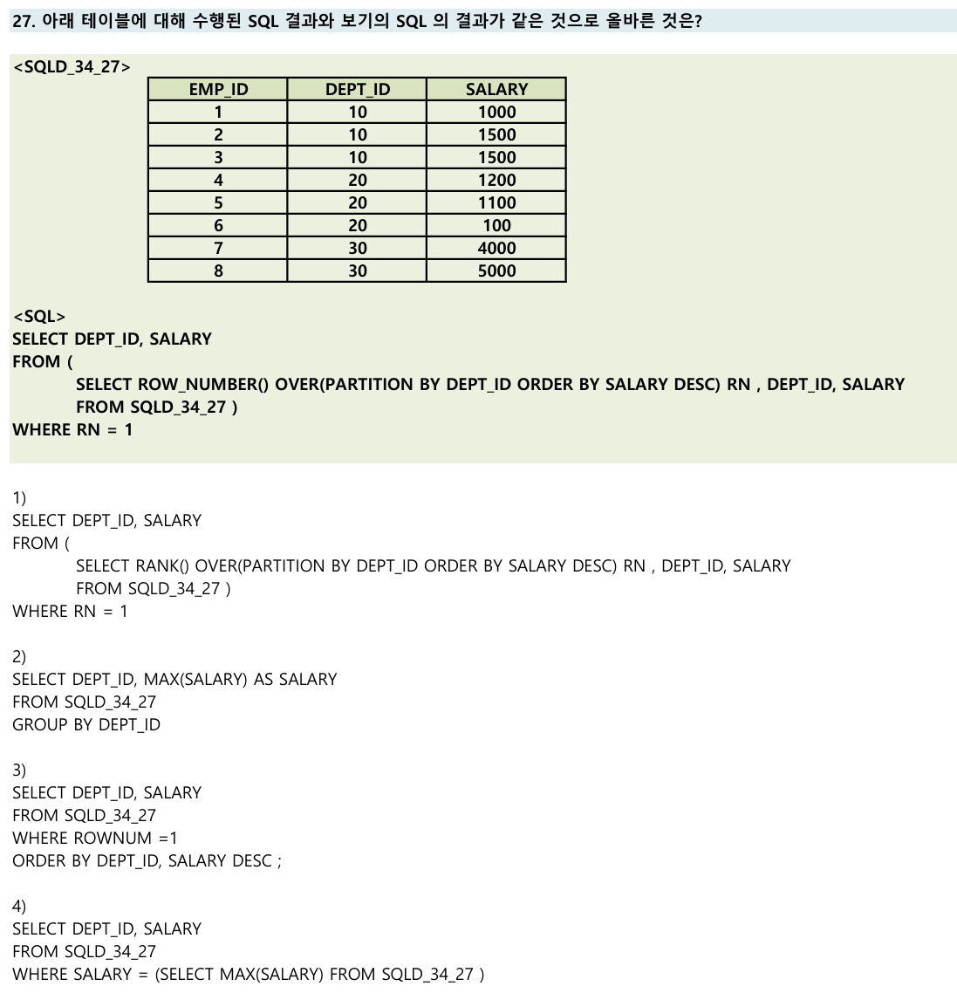

# 📌 윈도우 함수 + 부서별 연봉 조건 오답노트

| 항목        | 설명                                                                 |
| --------- | ------------------------------------------------------------------ |
| 핵심 개념   | `COUNT(*) OVER (PARTITION BY ... ORDER BY ... RANGE/ROWS ...)` 사용    |
| 조건 설명   |  1. 부서별로(`PARTITION BY department_id`)<br>2. 연봉 기준 오름차순(`ORDER BY salary`)<br>3. 현재 연봉 기준 **100 ~ 200 사이의 연봉자 수** 구하기 |
| 핵심 함수 구성요소 | `COUNT(*)`, `OVER`, `PARTITION`, `ORDER BY`, `RANGE` 또는 `ROWS` |

---

## ✅ 정답: **2번**

---

### ✅ 2번 설명

> `RANGE BETWEEN 100 PRECEDING AND 200 FOLLOWING`
> ⇒ **연봉을 기준으로 숫자 범위**를 의미함.

* `RANGE`는 값 자체의 범위 (ex: salary ± 범위)
* `ROWS`는 순번 기준 (현재 행 기준 앞뒤로 몇 개)

**요구사항이 "연봉이 100\~200 사이"이므로**,
`RANGE`를 사용하는 것이 적절합니다.

또한 `PARTITION BY department_id`를 통해
**부서별로 연봉자 수를 계산**하는 조건도 만족

---

### 📌 `RANGE` 예시: 연봉 기준으로 100 \~ 200 사이의 급여자 수 세기

#### 💡 테이블 예시 (`employees`)

| employee\_id | department\_id | salary |
| ------------ | -------------- | ------ |
| 1            | 10             | 100    |
| 2            | 10             | 120    |
| 3            | 10             | 150    |
| 4            | 10             | 170    |
| 5            | 10             | 200    |
| 6            | 10             | 250    |

---

각 사원의 급여를 기준으로 **±50** 범위에 속하는 사원 수를 구하고 싶을 때:

```sql
SELECT
  employee_id,
  salary,
  COUNT(*) OVER (
    PARTITION BY department_id
    ORDER BY salary
    RANGE BETWEEN 50 PRECEDING AND 50 FOLLOWING
  ) AS salary_range_count
FROM employees;
```

---

#### 🔍 예를 들어보면...

* `salary = 150`인 사원 기준으로 **100 \~ 200**의 급여를 가진 사원을 세면
  → `salary 100`, `120`, `150`, `170`, `200` → **5명**
* `salary = 100`이면
  → `salary 100`, `120`, `150` → **3명**
* `salary = 250`이면
  → `salary 200`, `250` → **2명**


---

### ❌ 1번 설명

* `ROWS BETWEEN 100 PRECEDING AND 200 FOLLOWING`
  → **값 기준이 아닌 행 개수 기준**
  → 문제의 "연봉 범위"와는 맞지 않음

---

### ❌ 3번 설명

* `PARTITION BY`만 존재, `ORDER BY`와 `RANGE/ROWS` 없음
  → **지정된 연봉 범위를 고려하지 않음**

---

### ❌ 4번 설명

* `PARTITION BY department_id`가 없음
  → **부서별 계산이 아님**

---

## 추가 개념 정리

| 키워드         | 설명                               |
| ----------- | -------------------------------- |
| `RANGE`     | 값 자체의 범위를 기준으로 윈도우 프레임 생성        |
| `ROWS`      | 현재 행 기준 몇 행 앞/뒤로 볼지, 물리적 행 개수 기준 |
| `PARTITION` | 그룹별 연산을 수행할 때 사용 (ex. 부서별 집계)    |
| `ORDER BY`  | 윈도우 함수에서 프레임 지정 시 정렬 기준 필수       |

---

## 느낀 점

* `RANGE`와 `ROWS`의 차이를 명확히 이해하고 있어야됨
* **값 기준의 범위 계산에는 `RANGE`**, **행 수 기준 계산에는 `ROWS`** 사용

---

# 📌 윈도우 함수 + 부서별 연봉 조건 오답노트 2

| 항목            | 설명                                                                 |
| --------------- | ------------------------------------------------------------------ |
| 핵심 쿼리 패턴      | `ROW_NUMBER() OVER(PARTITION BY DEPT_ID ORDER BY SALARY DESC)` 사용 |
| 비교 함수/문법      | `RANK()`, `GROUP BY + MAX`, `ROWNUM`, 서브쿼리 MAX                |
| 주의할 점         | RANK와 ROW_NUMBER의 차이, ROWNUM과 ORDER BY의 실행 순서, 집계 레벨     |

---

## 문제



---

## 기준 SQL

```sql
SELECT DEPT_ID, SALARY
FROM (
    SELECT ROW_NUMBER() OVER(PARTITION BY DEPT_ID ORDER BY SALARY DESC) RN, DEPT_ID, SALARY
    FROM SQLD_34_27
)
WHERE RN = 1
```
- 각 부서(DEPT_ID)별로 연봉(SALARY) 내림차순 정렬 후, 1등만 추출  
- 동점자가 있어도 부서별 1건만 출력됨

---

## ❌ 오답 분석

### ❌ 1번

> `RANK() OVER(PARTITION BY DEPT_ID ORDER BY SALARY DESC)` 사용

* RANK()는 동점자가 있으면 **여러 행이 RN=1**  
* 부서별 최고 연봉자가 여러 명이면 모두 출력됨  
* 기준 SQL은 **부서별 1건만** 출력 → 결과 다름  
* ❌ **정답 아님**

---

### ✅ 2번

> `SELECT DEPT_ID, MAX(SALARY) ... GROUP BY DEPT_ID`

* 부서별 최고 연봉만 추출  
* EMP_ID는 없지만, **DEPT_ID와 SALARY만 출력**  
* 동점자 있어도 한 행만 출력  
* 기준 SQL과 **결과 동일**  
* **정답!**

---

### ❌ 3번

> `WHERE ROWNUM = 1 ORDER BY DEPT_ID, SALARY DESC`

* ROWNUM은 **정렬 전에** 적용됨  
* 전체 테이블에서 한 행만 출력  
* 부서별 최고 연봉과 무관  
* ❌ **정답 아님**

---

### ❌ 4번

> `WHERE SALARY = (SELECT MAX(SALARY) ...)`

* 전체 테이블에서 최고 연봉만 추출  
* 부서별이 아님  
* ❌ **정답 아님**

---

## 추가 설명 & 복습 포인트

| 함수/문법         | 특징 및 차이점                                      |
| ---------------- | ------------------------------------------------- |
| ROW_NUMBER()     | 동점자 없이 순번 부여, 부서별 1건만 추출 가능            |
| RANK()           | 동점자 모두 같은 순위, 부서별 동점자 모두 추출됨         |
| GROUP BY + MAX   | 부서별 최고값만 추출, EMP_ID 등 다른 컬럼은 알 수 없음   |
| ROWNUM           | 정렬 전에 적용되어 원하는 결과가 아닐 수 있음           |
| 서브쿼리 MAX     | 전체 테이블에서 최고값만 추출, 부서별 아님             |


👉 Velog 링크: [SQL 순위 함수 정리](https://velog.io/@wjpark4430/SQL-순위-함수-정리-RANK-DENSERANK-ROWNUMBER-NTILEn)

---

## 느낀 점

* **윈도우 함수(ROW_NUMBER, RANK)와 GROUP BY의 차이**를 명확히 구분
* **ROWNUM, ORDER BY의 실행 순서**에 주의
* 문제에서 요구하는 "부서별" 조건을 항상 꼼꼼히 확인
* 동점자 처리 방식(ROW_NUMBER vs RANK)도 꼭 구분해서 기억