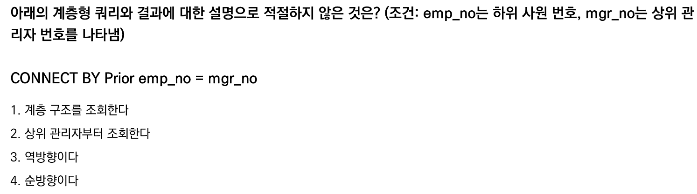

아래는 방금 설명한 내용을 바탕으로 만든 오답 노트 마크다운 템플릿입니다. 깃허브나 velog에 바로 사용하시면 됩니다!

# CONNECT BY 계층형 쿼리 - 순방향과 역방향 이해하기

## 문제  


---

## 오답 노트 정리

### 1. 기본 개념

* `emp_no`: 하위 사원의 번호
* `mgr_no`: 상위 관리자의 번호

---

### 2. `CONNECT BY PRIOR` 의미

* `PRIOR` 키워드는 "이전 행의 값"을 뜻함

---

### 3. 순방향 (하위 → 상위)

```sql
CONNECT BY PRIOR emp_no = mgr_no
```

* 이전 행의 `emp_no`(하위 사원 번호)와 현재 행의 `mgr_no`(상위 관리자 번호)가 같을 때 연결
* 즉, **이전 사원 번호가 관리자 번호인 행이 다음 행**
* 탐색 방향: **하위 → 상위**
* 출력 방향: **상위 → 하위**
* 정답에서 "순방향이다"는 맞는 설명

---

### 4. 역방향 (상위 → 하위)

```sql
CONNECT BY PRIOR mgr_no = emp_no
```

* 이전 행의 `mgr_no`(상위 관리자 번호)와 현재 행의 `emp_no`(하위 사원 번호)가 같을 때 연결
* 즉, **이전 관리자 번호가 사원 번호인 행이 다음 행**
* 탐색 방향: **상위 → 하위**
* 출력 방향: **하위 → 상위**

---

### 5. 문제 해설

* 문제의 쿼리는 `CONNECT BY PRIOR emp_no = mgr_no` 이므로,
  **하위에서 상위로 탐색하는 순방향**이 맞음
* 따라서 "상위 관리자부터 조회한다"와 "역방향이다"는 틀린 설명임

---

### 6. 추가 팁

* 보통 테이블에서 `mgr_no`가 NULL인 행이 최상위 관리자를 의미함
* 순방향 탐색 시 NULL인 최상위 관리자까지 거슬러 올라감

---

# 참고

* 하위 → 상위 = 순방향
* 상위 → 하위 = 역방향


