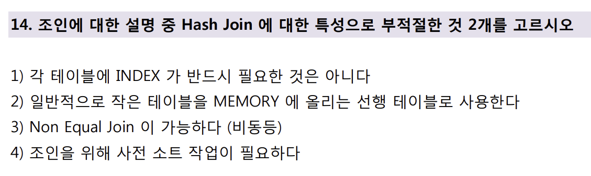

# 📌 Hash Join 오답노트

| 항목          | 설명                                                                   |
| ----------- | -------------------------------------------------------------------- |
| 조인 방식       | Hash Join은 **한 테이블(작은 테이블)을 메모리에 올려 해시 테이블**로 만들고, 다른 테이블의 행과 비교해 조인 |
| 인덱스 필요 여부   | **인덱스가 없어도 수행 가능**, Full Table Scan을 전제로 설계됨                         |
| 사용 조건       | 일반적으로 \*\*동등 조인(Equal Join)\*\*에 적합                                  |
| 사전 정렬 필요 여부 | **정렬(Sort) 작업 없이** 해시 기반으로 비교 진행                                     |
| 메모리 사용량     | 해시 테이블을 만들기 위해 **메모리 사용량이 크며**, 메모리 부족 시 디스크 I/O 발생 가능               |

---

## 문제



---

## ❌ 오답 1번: `각 테이블에 INDEX 가 반드시 필요한 것은 아니다`

* **사실**: 맞는 설명
* Hash Join은 **인덱스가 없어도 작동 가능**
* Full Table Scan이 전제되므로, **인덱스는 필수가 아님**

---

## ❌ 오답 2번: `일반적으로 작은 테이블을 MEMORY 에 올리는 선행 테이블로 사용한다`

* **사실**: 맞는 설명
* Hash Join은 보통 **작은 테이블을 메모리에 적재**
* 작은 테이블을 해시 테이블로 만들어, 큰 테이블을 스캔하며 조인 수행

---

## ✅ 정답 3번: `Non Equal Join 이 가능하다 (비동등)`

* Hash Join은 **Equal Join(동등 조인)** 에 적합
* `>, <, BETWEEN` 등의 **비교 연산자는 부적합**
* 이유: 해시 테이블은 키 값을 기준으로 빠르게 찾기 때문에, 정렬되지 않은 비동등 비교에 비효율적임

```sql
-- 비동등 조인에는 Hash Join 부적합
SELECT *
FROM emp e
JOIN salgrade s ON e.sal BETWEEN s.losal AND s.hisal;
-- 위와 같은 BETWEEN 조건에는 Nested Loop Join이나 Merge Join이 적절
```

---

## ✅ 정답 4번: `조인을 위해 사전 소트 작업이 필요하다`

* Hash Join은 **정렬이 필요 없는 조인 방식**
* 정렬이 필요한 것은 Merge Join의 특징
* Hash Join은 **해시 테이블을 기준으로 빠르게 탐색**하므로 정렬 과정 없이도 수행 가능

---

## 추가 설명 & 복습 포인트

| 항목                   | 내용                                            |
| -------------------- | --------------------------------------------- |
| Hash Join 장점         | 인덱스 없이도 조인 가능, 큰 테이블 조인에 유리                   |
| Hash Join 단점         | 메모리 사용량 큼, 비동등 조인 불가, 메모리 부족 시 성능 저하 가능       |
| 적합한 상황               | **Equal Join** + 인덱스가 없거나 **큰 테이블 조인 시**      |
| Merge Join과 비교       | Merge Join은 사전 정렬 필요, **Hash Join은 정렬 필요 없음** |
| Nested Loop Join과 비교 | 작은 테이블 반복 접근에 유리, 인덱스 활용 가능, 소규모 조인에 적합       |

👉 Velog 링크: [SQL 조인 방식 정리](https://velog.io/@wjpark4430/SQL-조인-방식-정리-Nested-Loop-Sort-Merge-Hash-Join)

---

## 느낀 점

* Hash Join은 **비교적 단순하고 강력한 조인 방식**이지만, 반드시 Equal Join 조건에서만 효과적이라는 제약을 다시 상기함
* 정렬이 필요 없다는 점은 Merge Join과의 명확한 차이점으로, 조인 방식 간 차이를 명확히 알고 적용할 필요가 있음을 느꼈음
* 단순히 조인의 개념을 외우는 게 아니라, **조건과 데이터 특성에 따라 어떤 조인 방식을 택할지 전략적으로 접근**해야 함을 다시 확인함
