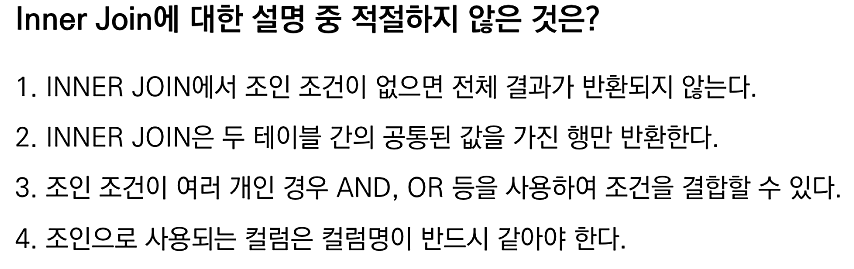

# 📌 INNER JOIN 오답노트

| 항목        | 설명                                                          |
| --------- | ----------------------------------------------------------- |
| 조인 방식     | `INNER JOIN`은 **두 테이블 모두에서 조건을 만족하는 행**만 반환됨                |
| 조건 미지정 시  | **조인 조건이 없으면 곱집합(Cartesian Product)** 발생, 의미 없는 대량 결과 출력 가능 |
| 컬럼명 일치 여부 | 조인에 사용되는 컬럼은 **컬럼명이 같을 필요는 없음**, 단 **데이터 타입은 호환되어야 함**      |
| 조건 조합 방식  | 여러 조건을 `AND`, `OR`로 **복합 조건**으로 조합 가능                       |

---

## 문제



---

## ❌ 오답 선택: 1번

> ❌ `INNER JOIN에서 조인 조건이 없으면 전체 결과가 반환되지 않는다.`

* 조인 조건이 없으면 **오히려 모든 행의 조합**, 즉 **곱집합(Cartesian Product)** 이 발생함
* 결과는 반환되지만 의미 없는 조합이 될 수 있고, 성능에도 악영향을 줄 수 있음

```sql
SELECT *
FROM A INNER JOIN B;
-- 조건 없이 조인 → A 테이블과 B 테이블의 모든 행 조합 발생 (A x B)
```

---

## ✅ 정답: 4번

> ❌ `조인으로 사용되는 컬럼은 컬럼명이 반드시 같아야 한다.`

* INNER JOIN에서는 **컬럼명이 달라도 문제 없음**
* 중요한 건 **비교 가능한 값인지, 즉 데이터 타입이 호환되는지 여부**

```sql
SELECT *
FROM employees e
INNER JOIN departments d
ON e.dept_id = d.id;  -- 컬럼명이 달라도 조인 가능
```

---

## 📘 추가 설명 & 복습 포인트

| 항목            | 내용                                   |
| ------------- | ------------------------------------ |
| 조건 없는 조인      | 조건 생략 시 곱집합 발생 (원하지 않는 결과 가능성 ↑)     |
| 컬럼명 필요 여부     | 컬럼명은 달라도 OK, 중요한 건 데이터 타입 호환         |
| 복합 조인 조건 작성   | `AND`, `OR`, 괄호 등을 활용해 다양한 조건 조합 가능  |
| INNER JOIN 핵심 | 양쪽 테이블 모두에서 **조건을 만족하는 행만** 반환       |
| JOIN 시 주의할 점  | 실수로 조건 생략 시 **성능 저하와 데이터 오류** 가능성 존재 |

👉 Velog 링크: [SQL JOIN 총정리](https://velog.io/@wjpark4430/SQL-JOIN-총정리-INNER-OUTER-CROSS-SELF-JOIN)

---

## ✏️ 느낀 점

* INNER JOIN에서 조건 생략은 문법상 허용되지만, **곱집합이 발생해 원하지 않는 결과**가 나올 수 있으므로 항상 조인 조건을 명확히 작성해야 함
* **컬럼명이 동일할 필요는 없으며**, **데이터 타입 호환성과 조인 조건**이 더 중요함을 다시 확인함
* 실수로 조인 조건을 빠뜨리는 경우 **대량의 잘못된 결과**나 **성능 저하**로 이어질 수 있기에 주의가 필요하다고 느꼈음
