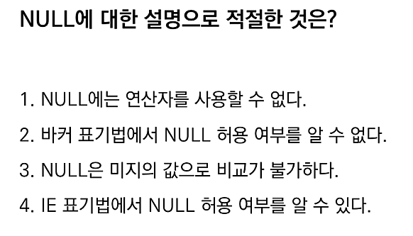

# 📌 NULL에 대한 설명 (오답노트)
| 항목    | 설명                                               |
| ----- | ------------------------------------------------ |
| 정의    | **알 수 없거나 존재하지 않는 값**을 의미                        |
| 의미    | 값이 아직 입력되지 않았거나, **모르는 상태**                      |
| 비교    | 어떤 값과도 같지 않으며, **비교 불가능** (`NULL = NULL`도 false) |
| 연산    | NULL과의 연산 결과는 **항상 NULL**                        |
| 필터링   | `WHERE column IS NULL`, `IS NOT NULL`로만 확인 가능    |
| 집계 함수 | 대부분의 집계 함수는 NULL을 **자동 제외**                      |

---

## 문제



---

## 오답 기록

### ❌ 오답: 1, 2, 4번

- 1번: **NULL에도 연산자를 사용할 수 있음**  
  - 하지만 일반 연산자 사용 시 결과가 `NULL` 또는 `UNKNOWN`이 되므로 주의 필요  
- 2번: **바커 표기법(Barker notation)**은 NULL 허용 여부를 나타냄  
- 4번: **IE 표기법(Information Engineering notation)**도 NULL 허용 여부 표현 가능  

### ✅ 정답: 3번  
- **NULL은 미지의 값(Unknown)으로, 일반적인 비교 연산(=, <, >)이 불가함**  
- 비교 연산은 `IS NULL`, `IS NOT NULL`로 처리해야 함  

---

## 추가 설명 & 복습 포인트

- `NULL`은 ‘값이 존재하지 않음’을 의미하며, ‘0’이나 ‘빈 문자열’과 다름  
- 비교 연산에서 `NULL`과의 직접 비교는 항상 `FALSE` 또는 `UNKNOWN`이므로 주의  
- `NULL` 관련 조건은 `IS NULL` / `IS NOT NULL` 키워드를 반드시 사용  
- ER 다이어그램 표기법(IE, Barker 등)에서 NULL 허용 여부는 각기 다른 방식으로 표현됨

👉 Velog 링크: [ERD 표기법 정리](https://velog.io/@wjpark4430/ERD-표기법-IE-표기법-vs-바커-표기법-feat.-NULL-표현-방식)

---

## 느낀 점
- `NULL`에 대한 개념과 표기법을 혼동하지 않도록 반복 학습 필요  
- 특히 `NULL`과 연산자 사용 시 결과 동작을 정확히 이해하는 게 중요

---

# 📌 `ORDER BY`와 `NULLS LAST` 오답노트

| 항목            | 설명                                                             |
| ------------- | -------------------------------------------------------------- |
| 정렬 기준         | `ORDER BY`로 컬럼을 오름차순(ASC), 내림차순(DESC) 정렬 가능                    |
| NULL 정렬 위치 제어 | `NULLS FIRST`, `NULLS LAST`로 정렬 시 NULL 값이 어디에 위치할지 명시적으로 지정 가능 |
| Oracle 기본 동작  | ASC일 때 NULL이 **먼저**, DESC일 때 NULL이 **나중** (하지만 명시하는 것이 안전함)    |

---

## 문제 (37회-45번)

Oracle 환경에서 아래와 같은 테이블 데이터를 다음과 같이 정렬하려고 할 때, `ORDER BY` 구문의 빈칸에 들어갈 적절한 키워드는?

```sql
-- 테이블 데이터
C1    C2
----------
10    100
10    200
10    NULL
20    100
20    NULL
20    200

-- 원하는 정렬 결과
C1    C2
----------
10    200
10    100
10    NULL
20    200
20    100
20    NULL
```

---

## ✅ 정답: `ORDER BY C1, C2 DESC NULLS LAST`

---

## ❌ 오답 이유

* `NULLS LAST`라는 옵션을 몰라서 괄호 안에 어떤 키워드를 넣어야 원하는 결과가 나오는지 헷갈림
* Oracle에서는 NULL의 정렬 위치가 **정렬 방향에 따라 기본적으로 달라지기 때문에** 명시적으로 `NULLS LAST`를 써주는 것이 중요

---

## 🔍 핵심 개념 정리

### 🔹 `ORDER BY`에서 NULL 정렬 위치 지정

| 키워드           | 설명                               |
| ------------- | -------------------------------- |
| `NULLS FIRST` | NULL 값을 정렬 결과의 가장 앞에 배치          |
| `NULLS LAST`  | NULL 값을 정렬 결과의 가장 뒤에 배치 (이 문제처럼) |

#### 기본 정렬 규칙 (Oracle 기준)

| 정렬 방향 | 기본 NULL 위치  |
| ----- | ----------- |
| ASC   | NULLS FIRST |
| DESC  | NULLS LAST  |

→ 따라서, 이 문제처럼 C2 컬럼을 **내림차순 정렬하면서 NULL은 마지막**에 오게 하려면 `DESC NULLS LAST`를 **명시적으로 써야 함**

---

##  느낀 점

* 단순한 정렬 문제 같아도 Oracle은 기본값이 다르므로 주의해야 함
* `NULLS LAST`는 시험에서 자주 출제되는 포인트이므로 완벽히 숙지할 것!

