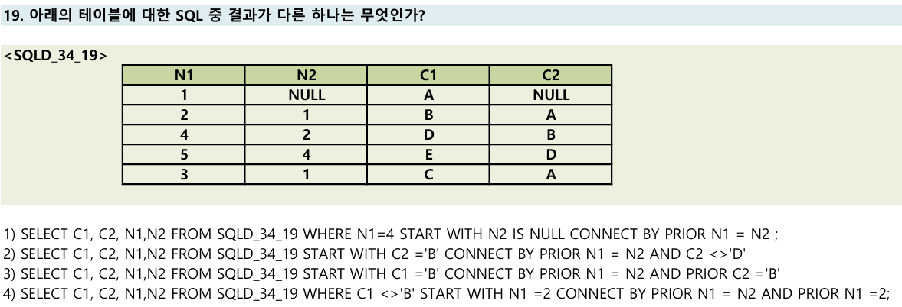

# CONNECT BY 계층형 쿼리 - 순방향과 역방향 이해하기

## 문제  


---

## 오답 노트 정리

### 1. 기본 개념

* `emp_no`: 하위 사원의 번호
* `mgr_no`: 상위 관리자의 번호

---

### 2. `CONNECT BY PRIOR` 의미

* `PRIOR` 키워드는 "이전 행의 값"을 뜻함

---

### 3. 순방향 (하위 → 상위)

```sql
CONNECT BY PRIOR emp_no = mgr_no
```

* 이전 행의 `emp_no`(하위 사원 번호)와 현재 행의 `mgr_no`(상위 관리자 번호)가 같을 때 연결
* 즉, **이전 사원 번호가 관리자 번호인 행이 다음 행**
* 탐색 방향: **하위 → 상위**
* 출력 방향: **상위 → 하위**
* 정답에서 "순방향이다"는 맞는 설명

---

### 4. 역방향 (상위 → 하위)

```sql
CONNECT BY PRIOR mgr_no = emp_no
```

* 이전 행의 `mgr_no`(상위 관리자 번호)와 현재 행의 `emp_no`(하위 사원 번호)가 같을 때 연결
* 즉, **이전 관리자 번호가 사원 번호인 행이 다음 행**
* 탐색 방향: **상위 → 하위**
* 출력 방향: **하위 → 상위**

---

### 5. 문제 해설

* 문제의 쿼리는 `CONNECT BY PRIOR emp_no = mgr_no` 이므로,
  **하위에서 상위로 탐색하는 순방향**이 맞음
* 따라서 "상위 관리자부터 조회한다"와 "역방향이다"는 틀린 설명임

---

### 6. 추가 팁

* 보통 테이블에서 `mgr_no`가 NULL인 행이 최상위 관리자를 의미함
* 순방향 탐색 시 NULL인 최상위 관리자까지 거슬러 올라감

---

# 참고

* 하위 → 상위 = 순방향
* 상위 → 하위 = 역방향

---

# 📌 Oracle 계층형 쿼리 (CONNECT BY) 오답노트

| 항목     | 설명                                                                                       |
| ------ | ---------------------------------------------------------------------------------------- |
| 계층형 쿼리 | Oracle에서 부모-자식 관계의 계층 구조를 탐색할 때 사용하는 쿼리 (`START WITH`, `CONNECT BY`)                     |
| 핵심 키워드 | `START WITH`: 시작 조건 / `CONNECT BY`: 연결 조건 / `PRIOR`: 연결의 방향성 결정                          |
| 방향성 이해 | `CONNECT BY PRIOR A = B`는 **부모 → 자식 (순방향)**, `CONNECT BY A = PRIOR B`는 **자식 → 부모 (역방향)** |

---

## 문제



---

## ❌ 오답 선택: 1번

> `SELECT C1, C2, N1,N2 FROM SQLD_34_19 WHERE N1=4 START WITH N2 IS NULL CONNECT BY PRIOR N1 = N2 ;`

### 🔍 오답 이유

* `START WITH N2 IS NULL` → N1 = 1 (루트 노드)
* `CONNECT BY PRIOR N1 = N2`
  → **이전 N1 = 현재 N2**
  → 순방향 탐색: `1 → 2 → 4 → 5`
* 하지만 `WHERE N1 = 4` 때문에 결국 **N1=4 한 줄만 출력**
* ✅ 따라서 **다른 번호들과 동일한 결과**를 가짐 → **정답이 아님**

---

## ✅ 정답: 3번

> `SELECT C1, C2, N1,N2 FROM SQLD_34_19 START WITH C1 ='B' CONNECT BY PRIOR N1 = N2 AND PRIOR C2 ='B'`

### 🔍 정답 이유

* `START WITH C1 = 'B'` → N1 = 2
* `CONNECT BY PRIOR N1 = N2 AND PRIOR C2 = 'B'`
  → N2 = 2 이고 \*\*PRIOR C2 = 'B'\*\*인 행을 찾아야 함
* N1 = 4인 행이 N2 = 2인데, **C2 = B**가 아니라 **C2 = D**
* → 조건 불충족으로 탐색 중단
* ✅ 따라서 **출력 결과는 한 줄 (시작 노드만)** → 다른 쿼리들과 **결과 다름**

---

## ✅ 각 선택지 분석

### 1번

```sql
SELECT ... WHERE N1=4 START WITH N2 IS NULL CONNECT BY PRIOR N1 = N2;
```

* 탐색 경로: 1 → 2 → 4 → 5
* WHERE N1 = 4 → **한 줄 출력**
* ✅ 결과: **C1 = 'D', N1 = 4**

---

### 2번

```sql
SELECT ... START WITH C2 ='B' CONNECT BY PRIOR N1 = N2 AND C2 <>'D';
```

* START: C2 = 'B' → N1 = 4 (C1 = D, C2 = B)
* 연결 조건:

  * PRIOR N1 = 현재 N2 → 4 → 5 (N2 = 4인 행 찾기)
  * 현재 C2 ≠ 'D' → N1 = 5의 C2 = D → **불일치 → 탐색 종료**
* ✅ 출력: **N1 = 4 한 줄**

---

### 3번 ✅ (정답)

* START: C1 = 'B' → N1 = 2
* 연결 조건: PRIOR N1 = N2 AND PRIOR C2 = 'B'
* N1 = 2의 C2 = 'A' → **조건 불충족 → 더 이상 연결 없음**
* ✅ 출력: **N1 = 2 한 줄**

---

### 4번

```sql
SELECT ... WHERE C1 <> 'B' START WITH N1 =2 CONNECT BY PRIOR N1 = N2 AND PRIOR N1 =2;
```

* START: N1 = 2
* 탐색 조건:

  * PRIOR N1 = N2 → N2 = 2인 행 → N1 = 4
  * PRIOR N1 = 2 → 조건 충족
* WHERE C1 ≠ 'B' → N1 = 2 제거
* ✅ 출력: **N1 = 4 한 줄**

---

## 복습 포인트

| 개념                       | 설명                        |
| ------------------------ | ------------------------- |
| `START WITH`             | 시작 행 지정                   |
| `CONNECT BY PRIOR A = B` | **A는 부모, B는 자식 (순방향 탐색)** |
| `CONNECT BY A = PRIOR B` | **A는 자식, B는 부모 (역방향 탐색)** |
| `WHERE` 절 위치             | 계층 구조 탐색 이후 필터링됨          |

---

## 느낀 점

* 계층형 쿼리는 \*\*방향성(PRIOR 위치)\*\*이 매우 중요하다.
* `WHERE` 조건이 실행 시점상 **가장 마지막**이라는 점을 기억하자.
* 오답을 통해 **CONNECT BY가 탐색하는 방식과 제한 조건에 대한 감각**이 생겼다.

---

👉 Velog 링크: [CONNECT BY 문법](https://velog.io/@wjpark4430/Oracle-계층형-쿼리-완전-정리-CONNECT-BY-문법)
