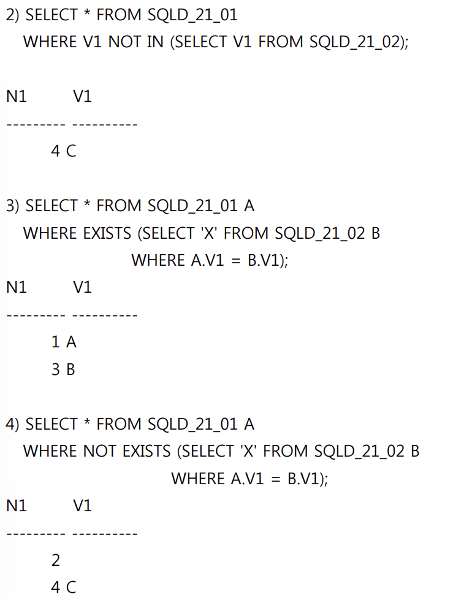

# 📌 Oracle에서 테이블 별칭 사용 시 `AS` 금지 (오답노트)

| 항목     | 설명                                                       |
| ------ | -------------------------------------------------------- |
| 배경 개념  | SQL에서 테이블에 별칭(alias)을 부여할 때 사용하는 구문                      |
| 표준 문법  | `SELECT T.* FROM 테이블명 T` ← 테이블 별칭은 **AS 없이** 공백으로 부여     |
| 오류 포인트 | Oracle에서는 테이블 별칭에 **`AS` 키워드 사용 불가** → `TAB AS T`는 오류 발생 |
| 허용 예시  | `SELECT T.* FROM TAB T` ← ✅ 정상 동작                        |
| 금지 예시  | `SELECT T.* FROM TAB AS T` ← ❌ Oracle에서는 **문법 오류 발생**    |

---

## 문제

---

## 오답 기록

### ❌ 오답: 3번

* `SELECT T.* FROM TAB AS T` → Oracle에서는 **`AS` 키워드로 테이블에 별칭 부여 불가**
* **구문 오류 발생**하며 실행되지 않음

### ✅ 정답: 3번

* 나머지 문장은 Oracle에서 정상 실행되며, 결과도 모두 동일
* **오직 3번만 오류가 발생하여 결과가 다름**

---

## 추가 설명 & 복습 포인트

* **컬럼에는 `AS` 사용 가능**, 테이블에는 ❌

  * 예: `SELECT col1 AS c1 FROM TAB` → 가능
  * 예: `SELECT * FROM TAB AS T` → Oracle에서 오류
* 다른 DBMS (MySQL, PostgreSQL 등)에서는 `AS` 허용되므로, DBMS별 차이 반드시 인지
* 실무/시험에서 Oracle 기준이라면 **문법 제한 사항**을 미리 숙지할 것

---

## 느낀 점

* **DBMS마다 SQL 문법에 차이 있음**을 확실히 체감
* 평소에 자주 쓰지 않는 구문이라도 Oracle에선 예외 사항을 **꼼꼼히 체크**해야 함
* 단순 결과 비교 문제가 아닌 **문법 자체 오류**도 주의해서 보기 분석할 것

---

# 📌 ANY 연산자 & 상사-부하 관계 해석 실수 (오답노트)

| 항목     | 설명                                                      |
| ------ | ------------------------------------------------------- |
| 배경 개념  | SQL에서 `ANY`는 **하나라도 조건을 만족하면 TRUE**가 되는 다중행 비교 연산자      |
| 사용 구조  | `컬럼 >= ANY (서브쿼리)` → 서브쿼리 결과 중 최소값 이상이면 TRUE            |
| 핵심 포인트 | `A.MANAGER_ID = B.EMPLOYEE_ID` → **A는 부하직원**, **B는 상사** |
| 오해 요소  | 부하와 상사의 위치, 연봉 비교 방향을 잘못 이해하면 정반대 의미로 해석됨               |

---

## 문제

---

## 오답 기록

### ❌ 오답: 3번 — "어떤 상사보다 연봉이 높은 부하 직원"

* **`A.MANAGER_ID = B.EMPLOYEE_ID` 해석 오류**
  → A가 상사이고 B가 부하라고 착각했음
* 하지만 실제로는 **A가 부하, B가 상사**
* `B.SALARY >= ANY A.SALARY`: **상사 B의 연봉이, 자신을 부하로 둔 A 중 한 명 이상보다 크거나 같을 때**

---

## ✅ 정답: 1번 — "어떤 부하 직원보다도 연봉이 높은 상사"

* 상사의 연봉이 부하 중 한 명이라도 보다 크거나 같으면 조건 만족
* 즉, **부하들 중 최소 연봉보다 높은 상사**들을 찾는 쿼리

---

## 추가 설명 & 복습 포인트

| 비교 연산자   | 의미                       | 예시 (서브쿼리 결과: 100, 200, 300)     |
| -------- | ------------------------ | ------------------------------- |
| `>= ANY` | 서브쿼리 중 **최소값 이상이면** TRUE | `250 >= ANY(...)` → TRUE (≥100) |
| `> ALL`  | 서브쿼리 중 **최댓값 초과해야** TRUE | `250 > ALL(...)` → FALSE (X)    |

**주의할 점**:

* `A.MANAGER_ID = B.EMPLOYEE_ID`에서 **B가 상사**임을 꼭 기억할 것
* 관계를 잘못 이해하면 연봉 비교 방향이 바뀜
* 테이블 조인 시 **역할(상사 vs 부하)** 구분이 매우 중요

---

## 느낀 점

* 테이블 조인에서 `A`, `B` 역할을 **직관적으로 오해**함
* 문제 해석 시에는 관계형 조건을 먼저 **자연어로 해석하고**, 그 다음 연산자의 의미를 연결해야 함
* 다음부터는 **"누가 누구의 상사인가?"** 관계 먼저 체크하고 조건을 해석

---

# 📌 `NOT IN`과 `NOT EXISTS`의 차이와 NULL 이슈 (오답노트)

| 항목       | 설명                                                                                     |
| -------- | -------------------------------------------------------------------------------------- |
| 배경 개념    | `IN`, `NOT IN`, `EXISTS`, `NOT EXISTS`는 **서브쿼리 결과를 기준으로 필터링**할 때 사용됨                   |
| 핵심 문법    | `V1 NOT IN (SELECT V1 FROM 테이블)` → **서브쿼리의 값과 일치하지 않는 값만 추출**                          |
| 오류 포인트   | **서브쿼리에 `NULL` 값이 포함된 경우 `NOT IN`은 항상 거짓(`FALSE`) 처리됨**                                |
| 핵심 차이점   | `NOT IN`은 NULL 포함 시 전체 결과가 **0건**, `NOT EXISTS`는 **NULL 무시하고 비교 가능**                   |
| 예상 결과 비교 | `NOT IN` → `C`만 나와야 하지만, `NULL` 포함되면 **전체 결과 없음** `NOT EXISTS` → 조건에 맞는 `2`, `4` 출력 |

---

## 문제

---

## 오답 기록

### ❌ 오답: 4번

* `NOT EXISTS`는 **NULL 값이 있어도 조건을 잘 만족함**
* `2`, `4`가 출력되는 게 맞는 결과
* 문제는 2번 쿼리의 결과 (`NOT IN`)를 잘못 이해해서 `4번이 틀렸다`고 판단함

### ✅ 정답: 2번

* `NOT IN` 서브쿼리 결과에 `NULL` 포함되면 → 전체 조건이 **FALSE**
* 결과적으로 `V1 NOT IN (A, 2, B)` → `2`는 NULL로 인해 비교 불가 → **모든 비교가 무시되어 결과 없음**
* 하지만 문제는 `4 C`가 출력됨 → **잘못된 결과**

---

## 추가 설명 & 복습 포인트

* `NOT IN` vs `NOT EXISTS` 핵심 정리

| 비교 항목   | `NOT IN`                | `NOT EXISTS`                    |
| ------- | ----------------------- | ------------------------------- |
| NULL 처리 | 서브쿼리에 NULL 있으면 전체 결과 없음 | NULL 무시하고 조건 만족 여부 판단 가능        |
| 권장 사용   | **NULL 없는 경우**에만 안정적 사용 | **NULL 있어도 안전함** → 실무에서 더 많이 쓰임 |
| 성능 측면   | 간단한 값 비교에 유리            | 복잡한 조건, 관계형 비교에 적합              |

---

## 느낀 점

* **`NOT IN`은 NULL 포함 여부에 매우 민감**하다는 것을 확실히 배움
* 단순히 값 비교처럼 보여도 **서브쿼리 결과의 특성을 잘 파악해야 정확한 판단 가능**
* 앞으로는 `NOT EXISTS`를 기본으로 고려하고, `NOT IN`은 **NULL 포함 여부 먼저 확인**할 것!

---

## 📌 `ROLLUP`, `GROUPING SETS`, `UNION ALL`, `CUBE` 차이 (오답노트)

| 항목    | 설명                                                              |
| ----- | --------------------------------------------------------------- |
| 설명 주제 | `ROLLUP`, `GROUPING SETS`, `CUBE`, `UNION ALL` 사용 시 결과 집합 차이 비교 |
| 핵심 개념 | `CUBE`는 모든 조합에 대한 집계를 생성하지만, 나머지는 일부 조합 또는 명시된 조합만 출력함          |
| 출제 의도 | 그룹 함수 및 그룹 집계 연산자들의 결과 차이를 이해하고, 실제 결과가 다른 쿼리를 구분할 수 있는지 평가     |
| 문제 유형 | 그룹 함수 고급 활용 (`ROLLUP`, `CUBE`, `GROUPING SETS`, `UNION ALL`)    |
| 정답    | ✅ 4번 (오답 선택: 1번)                                                |

---

## 문제

---

## 오답 기록

### ❌ 오답: 1번

* `ROLLUP`이 하위에서부터 계층적으로 요약하는 방식이므로, 각각의 최종 합계를 포함한다고 생각했음
* `UNION ALL` 방식과 `CUBE`, `GROUPING SETS`이 결과가 유사하다고 판단하여 `1번`을 선택함
* 하지만 `CUBE`의 모든 조합을 포함하는 함수라는 것에 대한 공부 부족

### ✅ 정답: 4번

* `CUBE(DNAME, JOB)`는 `GROUPING SETS((DNAME, JOB), (DNAME), (JOB), ())`와 동일한 결과를 출력
* 즉, `DNAME`, `JOB` 각각의 총합과 전체 총합까지 **모든 조합**이 포함됨
* 나머지 쿼리들은 `전체 조합을 모두 포함하지 않음`

---

## 추가 설명

| 함수/구문           | 설명                                                                                  |
| --------------- | ----------------------------------------------------------------------------------- |
| `ROLLUP(A, B)`  | `GROUP BY (A, B)`, `GROUP BY (A)`, `GROUP BY ()` → **계층적 요약 (상위 집계)**               |
| `CUBE(A, B)`    | `GROUP BY (A, B)`, `GROUP BY (A)`, `GROUP BY (B)`, `GROUP BY ()` → **모든 조합의 집계 포함** |
| `GROUPING SETS` | 명시된 조합만 집계 (예: `((A, B), A, NULL)` 등)                                               |
| `UNION ALL` 방식  | 직접 쿼리를 나눠서 모든 집계를 수동으로 구성                                                           |

💡 `CUBE`는 완전한 교차 조합을 포함하므로, 결과가 가장 많고 구조적으로도 가장 복잡함. 따라서 **결과값이 다르다**고 할 수 있음.

---

## 느낀 점
* `ROLLUP`과 `CUBE`의 가장 큰 차이는 **모든 조합의 집계 여부**라는 점을 명확히 이해
* 기존에는 `ROLLUP`, `GROUPING SETS`, `UNION ALL` 방식이 모두 같은 결과를 낸다고 착각
* `CUBE`만이 `DNAME`, `JOB`의 **모든 조합 + 전체 요약까지 포함**된다는 점이 결정적인 차이
* `GROUP BY` 관련 함수들을 사용할 때 **결과의 포함 범위**에 주의해서 사용 필요