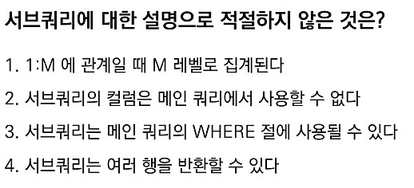

# 📌 서브쿼리(Subquery) 오답노트

| 항목           | 설명                                                         |
| ------------ | ---------------------------------------------------------- |
| 서브쿼리 위치      | `WHERE`, `FROM`, `SELECT` 절 등 다양한 위치에 사용 가능                |
| 컬럼 사용 가능 여부  | 서브쿼리의 컬럼은 **메인 쿼리에서 참조 가능** (특히 `FROM` 절에 사용된 Inline View) |
| 다중행 반환 가능 여부 | 서브쿼리는 `IN`, `EXISTS` 등과 함께 **여러 행 반환 가능**                  |
| 결과 레벨        | 서브쿼리의 레벨이 아닌, **메인 쿼리 레벨로 결과 집합이 생성**됨                     |

---

## 문제



---

## ✅ 정답: **1번, 2번 (복수 정답)**

---

### ❌ 1번 설명

> `1:M 관계일 때 M 레벨로 집계된다`

* 이는 **항상 그런 것이 아님**.
* 실제 결과는 **항상 메인 쿼리 레벨**에서 만들어집니다.

📘 예시 설명:

> 메인 쿼리: 조직(1), 서브 쿼리: 사원(M) 
> → 결과는 **조직(1) 레벨**로 생성됨

다만, **Inline View**나 조인 상황에 따라 **M 레벨로도 집계** 가능하므로
“항상 M 레벨로 집계된다”는 표현은 부정확합니다.

```sql
-- M 레벨 집계도 가능하긴 하나, 항상 그런 건 아님
SELECT e.emp_id, sub.avg_salary
FROM employees e
JOIN (
  SELECT dept_id, AVG(salary) AS avg_salary
  FROM employees
  GROUP BY dept_id
) sub ON e.dept_id = sub.dept_id;
```

---

### ❌ 2번 설명

> `서브쿼리의 컬럼은 메인 쿼리에서 사용할 수 없다`

* **잘못된 설명입니다. 사용할 수 있습니다.**
* 특히 `FROM` 절의 **Inline View**로 사용되면,
  **서브쿼리 결과를 테이블처럼 사용**하며 **컬럼 접근 가능**합니다.

```sql
SELECT sub.total_salary
FROM (
  SELECT dept_id, SUM(salary) AS total_salary
  FROM employees
  GROUP BY dept_id
) sub;
```

---

## 📘 추가 설명 & 복습 포인트

| 개념              | 설명                                                    |
| --------------- | ----------------------------------------------------- |
| 서브쿼리 위치         | `WHERE`, `FROM`, `SELECT` 등 위치에 따라 역할 달라짐             |
| 서브쿼리 컬럼 접근 방법   | `FROM` 절의 서브쿼리는 별칭을 통해 컬럼 접근 가능 (`sub.column`)        |
| 여러 행 반환 시 사용 문법 | `IN`, `EXISTS`, `ANY`, `ALL` 등 사용 가능                  |
| 결과 레벨           | 항상 **메인 쿼리의 레벨** 기준으로 결과가 생성됨. 단, 조인 등으로 **M 레벨도 가능** |

---

## ✏️ 느낀 점

* **서브쿼리의 결과 레벨은 메인 쿼리가 결정한다**는 개념을 명확히
* **Inline View**를 활용하면 서브쿼리 컬럼도 적극적으로 사용 가능