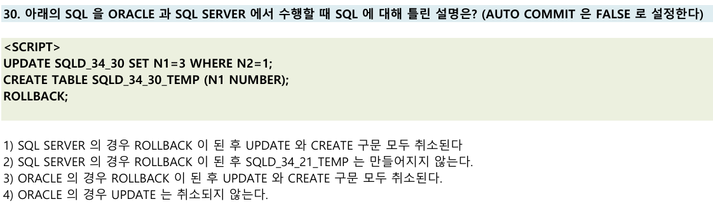
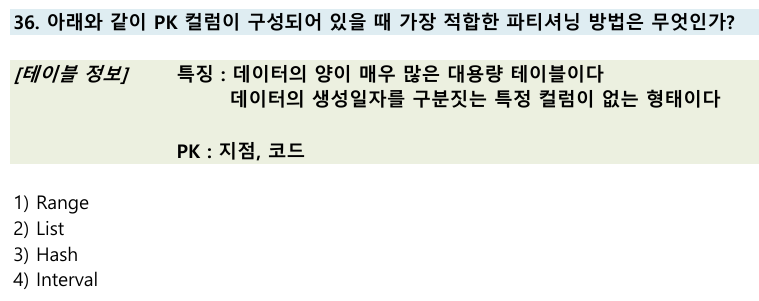

# 📌 트랜잭션과 DDL(ORACLE vs SQL SERVER) 오답노트

| 항목                | 설명                                                                                 |
|-------------------|------------------------------------------------------------------------------------|
| 트랜잭션(ROLLBACK)   | DML(UPDATE 등)은 ROLLBACK으로 취소 가능, DDL(CREATE 등)은 DBMS마다 다름                      |
| ORACLE의 DDL 처리     | DDL 실행 시 **자동 커밋(AUTO COMMIT)** 발생 → ROLLBACK 불가                             |
| SQL SERVER의 DDL 처리 | DDL도 트랜잭션에 포함되어 ROLLBACK 가능 (명시적 트랜잭션 내에서)                         |
| 주의할 점             | DDL/트랜잭션 처리 방식이 DBMS마다 다르므로, ROLLBACK 동작을 반드시 구분해야 함                |

---

## 문제

---

## ✅ 정답: **4번**

### ✅ 1번 설명
> SQL SERVER의 경우 ROLLBACK이 된 후 UPDATE와 CREATE 구문 모두 취소된다

- SQL SERVER는 트랜잭션 내에서 DML/DDL 모두 ROLLBACK 가능  
- **설명 맞음**

---

### ✅ 2번 설명
> SQL SERVER의 경우 ROLLBACK이 된 후 SQLD_34_21_TEMP는 만들어지지 않는다

- CREATE TABLE도 트랜잭션에 포함되어 ROLLBACK 시 생성 안 됨  
- ✅ **설명 맞음**

---

### ❌ 3번 설명(정답)  
> ORACLE의 경우 ROLLBACK이 된 후 UPDATE와 CREATE 구문 모두 취소된다

- ORACLE은 DDL(CREATE TABLE) 실행 시 **자동 커밋** 발생  
- ROLLBACK 해도 DDL 이전까지의 DML만 취소되고,  
  **CREATE TABLE은 취소되지 않음**  
- ❌ **설명 틀림** 

---

### ✅ 4번 설명
> ORACLE의 경우 UPDATE는 취소되지 않는다

- ORACLE에서 UPDATE는 ROLLBACK 시 **반드시 취소됨**
- 하지만 ORACLE은 DDL(CREATE TABLE) 실행 시 **자동 커밋** 발생
- ✅ **설명 맞음**

---

## 복습 포인트

| 구분      | ORACLE                                      | SQL SERVER                        |
|---------|---------------------------------------------|----------------------------------|
| DML      | ROLLBACK 가능                                 | ROLLBACK 가능                     |
| DDL      | **자동 커밋 발생 → ROLLBACK 불가**               | 트랜잭션 내에서 ROLLBACK 가능         |
| 혼합 사용 | DDL 이후 ROLLBACK 시 DML만 취소, DDL은 남아있음     | DML/DDL 모두 ROLLBACK 시 취소         |

---

## 느낀 점

* **DBMS별 트랜잭션 처리 방식(특히 DDL의 ROLLBACK 처리)**을 반드시 구분해서 기억
* ORACLE은 DDL 실행 시 자동 커밋이 발생하므로, DML만 롤백됨

---

# 📌 파티셔닝(List Partition) 오답노트

## 문제

---

## 보기별 해설

| 방식      | 특징 및 적합성                                                                 |
|---------|----------------------------------------------------------------------------|
| Range   | 날짜/숫자 등 연속된 범위로 분할. **범위 컬럼이 없으므로 부적합**                        |
| List    | **특정 값(지점, 코드 등)으로 파티션 분할.** 값의 종류가 명확하고, 논리적으로 구분될 때 적합. **정답** |
| Hash    | 값이 너무 다양하거나 균등 분산이 필요할 때 사용. 값의 종류가 많을 때 적합.                   |
| Interval| 날짜/시간 등 일정 간격으로 자동 분할. **범위 컬럼이 없으므로 부적합**                        |

---

## 왜 List가 정답인가?

- **지점, 코드**처럼 값의 종류가 명확하고, 각 값이 논리적으로 구분되는 경우  
  → **List 파티셔닝**이 가장 적합
- 대용량 테이블이어도, 파티션을 "지점별", "코드별"로 나누면  
  관리와 조회 성능이 좋아짐
- 값의 종류가 너무 많지 않다면(예: 전국 20개 지점, 10개 코드 등)  
  → 파티션 수가 적당하므로 대용량에도 효과적

---

## 오답 포인트

- **Hash**: 값이 너무 많거나, 균등 분산이 필요할 때 사용.  
  하지만 값의 집합이 명확할 때는 List가 더 직관적이고 관리가 쉬움
- **Range/Interval**: 범위 컬럼(날짜 등)이 없으므로 부적합

---

## 복습 포인트

- **List 파티셔닝**: 값의 집합(지점, 코드 등)으로 논리적 구분이 명확할 때 적합
- **Hash 파티셔닝**: 값이 너무 많거나, 균등 분산이 필요할 때 사용
- **Range/Interval**: 날짜/숫자 등 범위 컬럼이 있을 때만 사용

---

## 느낀 점

- 파티셔닝은 **컬럼의 특성과 데이터 분포**에 따라 적합한 방식을 선택해야 함
- 값의 집합이 명확하면 대용량이어도 List 파티셔닝이 정답이 될 수 있음음